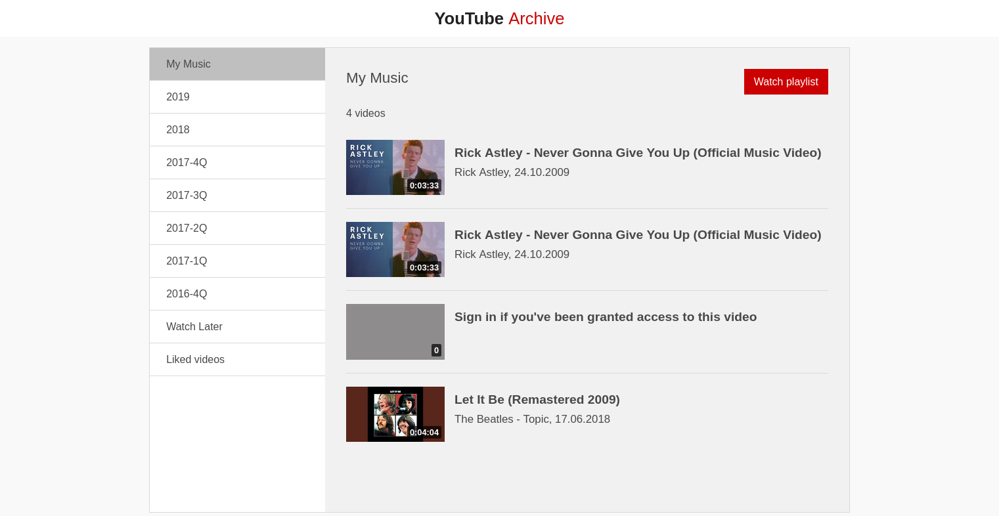

# YouTube Playlist Exporter

A python tool for exporting your YouTube playlists in HTML format. 
It converts playlist data from CSV files to a usable HTML document.

## Usage
1. Download your YouTube data using [Google Takeout](https://takeout.google.com). 
This will yield a zip file containing CSV files, one for each playlist.
2. Supply all configuration values, especially the path to your CSV files, in `config.cfg`.
3. Execute the script by running `python3 main.py`.

## License

This project is licensed under the [GNU General Public License v3.0](https://www.gnu.org/licenses/gpl-3.0).

*This project is not endorsed or certified by YouTube or Google.*
